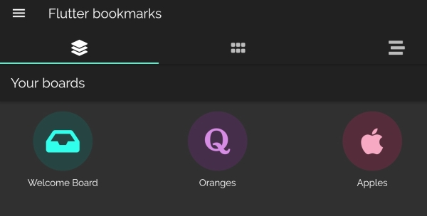
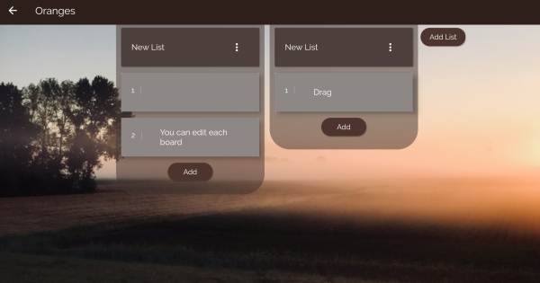
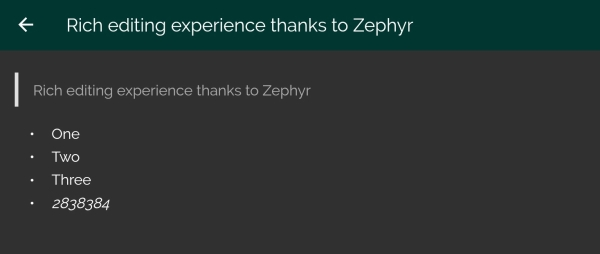
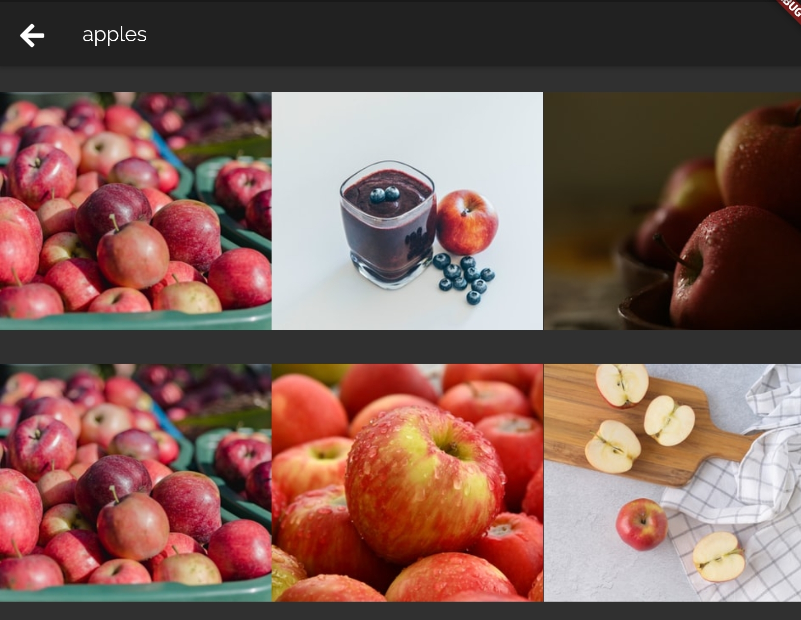

# Flutter bookmarks

Flutter bookmarks is a colorful Android application to store bookmarks and notes, inside kanban boards.

I made this application in the times of Covid-19 to teach myself [Dart](https://dart.dev/) and [Flutter](https://flutter.dev/).
The application has only been tested in a Tablet.

## Screenshots

The first screen is where you select your boards.



A board has panes with cards that you can drag around.



Each card can be edited with a rich editor, courtesy of [zephir](https://pub.dev/packages/zefyr). 



You can customize Boards with background images from [Unsplash](https://unsplash.com/) and Icons from [Font awesome](https://fontawesome.com/)



## Installation

Get the dependencies: 
```
flutter pub get
```

Run the application:
```
flutter run
```

## Author

Cristian Vasquez